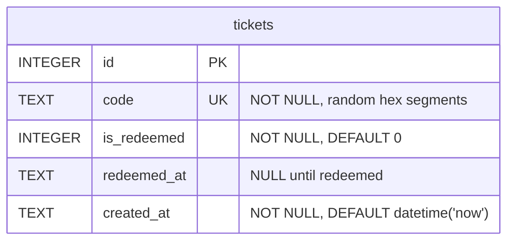

# Movie Ticket App :ticket:

A small fullstack ticket system, built as an assignment for an API-development Node.js course. Tickets are created with a randomly generated code, can be redeemed once, and unused tickets can be deleted.

The focus of the assignment is CORS. The frontend and the backend run on different ports, so every request from the browser is cross-origin.

## Tech stack

**Backend** — Node.js, Express 5, better-sqlite3, ES modules. Tested with Vitest and Supertest.

**Frontend** — Vite, React, TypeScript. Tested with Vitest and React Testing Library.

## Database design

<!--  -->



The database has only one table:

```sql
CREATE TABLE IF NOT EXISTS tickets (
  id INTEGER PRIMARY KEY,
  code TEXT NOT NULL UNIQUE,
  is_redeemed INTEGER NOT NULL DEFAULT 0,
  redeemed_at TEXT,
  created_at TEXT NOT NULL DEFAULT (datetime('now'))
)
```

SQLite has no boolean type, so `is_redeemed` is stored as `0` or `1`.

`redeemed_at` is `NULL` until the ticket is redeemed.

## Getting started

### Prerequisites

- [Node.js](https://nodejs.org/en/download) (latest LTS recommended)
- npm (included with Node.js)

Verify with `node -v` and `npm -v`.

### Installation

```bash
git clone https://github.com/vuoalex/movie-ticket-app.git
cd movie-ticket-app
```

**Backend**

```bash
cd backend
npm install
cp .env.example .env
npm run dev
```

Runs on http://localhost:3000. The database file is created automatically on first start.

**Frontend**

```bash
cd frontend
npm install
cp .env.example .env
npm run dev
```

Runs on http://localhost:5173.

Both the frontend and backend has to be running at the same time, in their own terminals.

## API

Base path: `/api/tickets`

| Method | Path | Success | Errors |
|---|---|---|---|
| GET | `/api/tickets` | 200, array of tickets | — |
| GET | `/api/tickets/:id` | 200, ticket | 404 not found |
| POST | `/api/tickets` | 201, created ticket | — |
| PATCH | `/api/tickets/:id/redeem` | 200, updated ticket | 404 not found, 409 already redeemed |
| DELETE | `/api/tickets/:id` | 204, no body | 404 not found, 409 ticket is redeemed |

Errors are returned as `{ "error": "message" }` with the matching status code.

Redeemed tickets can't be deleted, and that's by design to keep a record of them.

## Test-driven development (TDD)

Both the backend and frontend were built test-first, following red-green-refactor. The commits are intentionally split so the order is visible in the history, the failing test is committed before the code that makes it pass.

### Backend — `POST /api/tickets`

1. `bb04641` — `test: add failing test on ticket creation`   
No route existed yet, so Express returned 404 where the test expected 201.
2. `b78fc12` — `feat: add POST /tickets endpoint`   
Wired through route → controller → service. Test passes.
3. `87e8562` — `test: use memory db for tests`   
The tests were writing to the real database, so `vitest.config.js` now points them to an in-memory database and tests now start from a clean table.

### Frontend — create ticket

1. `b55a718` — `test: add failing test for create ticket button`   
The button existed but had no click handler, so no request was ever made.
2. `161c441` — `feat: post to the tickets API when button is clicked`   
The click handler. Test passes.
3. `de9789f` — `refactor: move fetch logic out of the component`   
The API calls moved into their own module. Behaviour unchanged, test still passes.

## Testing

```bash
cd backend && npm test
cd frontend && npm test
```

## CORS

The frontend runs on a different port (5173) than the backend (3000), which means the browser treats every API call as cross-origin and blocks it unless allowed.

The allowed origin is read from the `CORS_ORIGIN` environment variable, because it is different in development and production:

```js
const CORS_ORIGIN = process.env.CORS_ORIGIN || "http://localhost:5173";

app.use(cors({ origin: CORS_ORIGIN }));
```

## Authorization

In a real system, listing all tickets, redeeming and deleting would be restricted to staff, while looking up a single ticket could stay open since the code itself acts as the key. It is not implemented in this version.